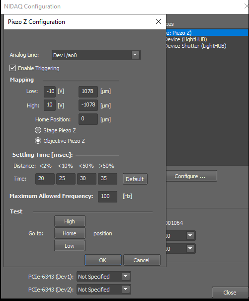

# Analog control for NIS-Elements

This folder describes the historical NIS-Elements control path where the PI PIMag stage is presented to NIS-Elements as an analog **Piezo Z** device.

In this mode, the C-413 is configured in PIMikroMove so that an analog voltage from the NI DAQ is used as the target/control source for the PIMag axis. NIS-Elements then changes the DAQ output voltage and uses its own calibration table to convert requested “Z” positions into voltages.



## Why this is a hack

NIS-Elements is not directly controlling the PIMag using PI motion commands. It is treating the PIMag/C-413 as if it were a generic analog piezo Z device.

The C-413 receives the analog voltage on its analog input. The macro in this folder maps the analog input to axis 1 and scales the analog voltage into the controller coordinate system. NIS-Elements applies its own empirical voltage-to-distance calibration and waits for the motion to settle before acquiring images.

In the screenshot above:

- Analog output line: `Dev1/ao0`.
- Voltage range: `-10 V` to `+10 V`.
- NIS distance mapping: `-10 V -> +1078 µm`, `+10 V -> -1078 µm`.
- Home position: `0 µm`.
- Empirical settling times: `20`, `25`, `30`, `35 ms` depending on move size.
- Maximum allowed frequency: `100 Hz`.

The `±1078 µm` magnitude corresponds to the 17.5° prism geometry in the main README for a 5 mm PIMag range. The sign is system-specific and should be checked on the microscope.

## Required PIMikroMove setup order

Use this order when preparing the PIMag for NIS-Elements analog-voltage control:

1. Open **PIMikroMove**.
2. Connect to the C-413 over USB. If the controller is not visible, check power and USB connection.
3. Start up the axes.
4. Reference/autozero the relevant PIMag axis if needed. This checks that the axis is responsive and has a valid reference state.
5. Turn on servo control for the axis.
6. Load the host macro in PIMikroMove.
7. Run [`c413_v522_analog_voltage_control.txt`](c413_v522_analog_voltage_control.txt).
8. Leave the controller powered and connected. The PIMag should now respond to the DAQ voltage controlled by NIS-Elements.

If the controller was previously left in external analog-voltage control mode, referencing may fail. A practical recovery route is to power-cycle the C-413, reconnect in PIMikroMove, reference/autozero, turn the servo back on, and then run the macro again.

## Macro command-by-command notes

The macro is intentionally plain text and contains only the commands that should be pasted/loaded into PIMikroMove.

```text
1 CCL 1 advanced
```

Enter command level 1 using the `advanced` password so protected parameters can be changed.

```text
1 SPA 1 0x06000500 5
```

Connect input signal channel 5, i.e. analog input 1, to axis 1 as the target/control source. Once this is active, the analog input overrides target/control values that would otherwise come from normal motion commands or the wave generator.

```text
1 SPA 1 0x07000000 -2.5
1 SPA 1 0x07000001 2.5
```

Set the minimum and maximum commandable position limits for axis 1 to `-2.5` and `+2.5` in the controller coordinate system.

```text
1 SPA 5 0x02000200 0
1 SPA 5 0x02000300 0.025
1 SPA 5 0x02000400 0
1 SPA 5 0x02000500 0
1 SPA 5 0x02000600 0
```

Scale analog input channel 5 using a linear polynomial:

```text
scaled_value = offset + gain * normalized_value
```

Here the offset is `0`, the gain is `0.025`, and higher-order correction terms are zeroed. With the C-413 convention that `-10 V` to `+10 V` corresponds to normalized values from `-100` to `+100`, this maps the full analog range onto `-2.5` to `+2.5` controller units.

```text
1 POS? 1
```

Query axis 1 position. This is mainly a sanity check after the target-source and scaling changes.

```text
1 SPA 1 0x07001006 0
1 SPA 1 0x07001005 3
```

Set the position-monitor output offset and scaling for axis 1.

```text
1 SPA 3 0x0A000003 2
1 SPA 3 0x0A000004 1
```

Configure output signal channel 3 as a monitor of the position of axis 1.

## NIS acquisition modes

### Software-timed NIS stepping

This is the safer historical mode. NIS-Elements writes a new analog voltage, waits according to the empirical settling table, then acquires an image. This is slower but easier to reason about.

### NIS triggered piezo waveform mode

This is more dangerous and should be validated carefully. NIS-Elements can run through a hardware-timed waveform of analog voltage values on the NI DAQ and acquire images after each step. In that case the DAQ timing, camera exposure, PIMag settling, and voltage limits all need to be checked together.

## Validation checklist

Before imaging valuable samples:

- Confirm the PIMag moves in the expected direction for a positive NIS Z step.
- Confirm the requested NIS range does not command the PIMag into a hard stop.
- Confirm the PIMag settles before the camera exposure.
- Start with small scan ranges and low speed.
- Check that the stage is not left in analog-control mode when you expect to use PI motion commands, stage-triggered scanning, or wavetable control.
